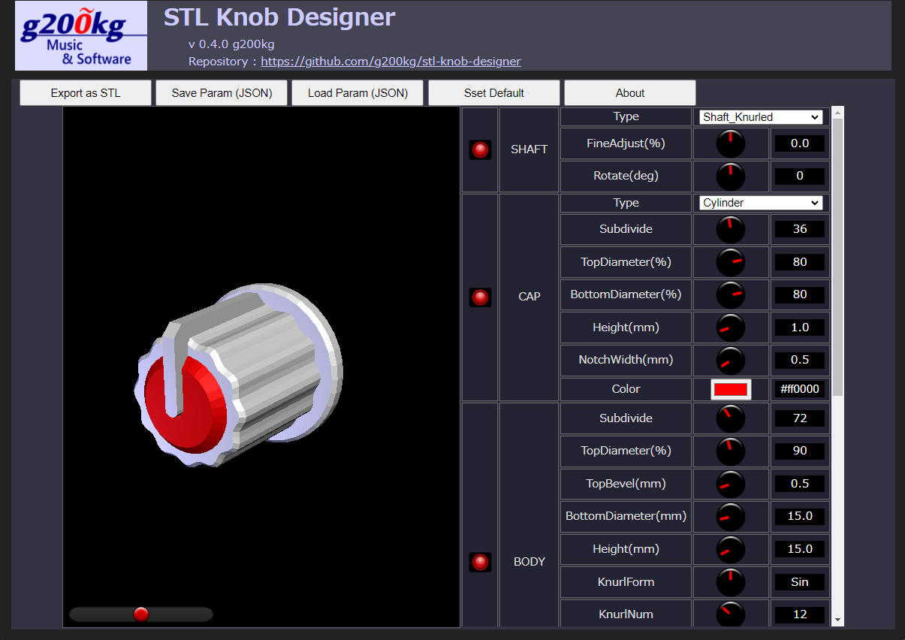

# stl-knob-designer

### Knob Designer for 3D printers

* This is a program that generates STL files of potentiometer-knobs for 3D printers. This program assumes that the potentiometer has a 6mm diameter and a knurled or D-shaped shaft.

* This program assuming use with an FDM machine, and a slightly elastic filament such as PETG rather than PLA. You should more precisely adjust the shaft joint if you want to use PLA.

* If your printer can output '3DBenchy' model fine without supports, you don't need to add supports.　When placing the tip of the knob upwards on the platform, the base of the knob has an overhang at a 45 degree angle.

* Depending on the printer model, settings and filament type, it may be necessary to fine-tune the fit with the shaft. For slicers such as "Cura", the [Horizontal Expansion] and [Hole Horizontal Expansion] settings affect the size of the shaft-hole. You should adjust the size of the hole-shape in advance with these settings. 

* Also the fitting to the shaft can be fine-tuned with the [SHAFT]-[FineAdject] parameter of this program. If your 3D printer creates a 6mm designed hole exactly as a 6mm hole, then [FineAdjust] would be around 0. For example, if a hole designed for 6mm diameter ends up being 5.7mm, [FineAdjust] would be around [+5%] to give an appropriate size.

* The color setting is not reflected in the STL file, you can pause at a specific layer in the slicer and manually swap filaments.

----

* これは 3D プリンタで造形可能なツマミの STL ファイルを生成するプログラムです。6mm 径の ローレット軸または D 型のシャフトを持つポテンショメータ用のツマミのデータを生成します。

* FDM 機での使用を想定しており、フィラメントは PLA よりも PETG 等の多少の弾力性のある材料の方が簡単です。 PLA でも造形可能ですが、シャフトとの篏合の硬さの調整がシビアになります。
サポート無しで '3DBenchy' くらいがちゃんと造形できているのであれば、サポートの追加は必要ありません。プラットフォームにノブの先端を上向きに配置した時、ノブの底の部分にオーバーハングがありますが角度は 45 度になっています。

* プリンタの機種やフィラメントの種類によって印刷設定等で、シャフトとの篏合を微調整する必要があるかもしれません。 Cura ベースのスライサーでは [水平展開 (Horizontal Expansion)] と [穴の水平展開 (Hole Horizontal Expansion)] の設定がシャフトが入る穴のサイズに影響します。これらの設定で穴形状の造形時に誤差が無くなるようにあらかじめ補正しておいてください。

* シャフトとの篏合の硬さは [SHAFT]-[FineAdjust] で微調整できます。もしあなたの 3D プリンタが 6mm 径に設計した穴を造形した時に 6mm 丁度の穴ができるのであれば　[FineAdjust] は 0 付近、例えば 6mm 径に設計した穴が 5.7mm になってしまうのならば [FineAdjust] は +5% 付近で適切なサイズになるはずです。

* 色の設定は STL ファイルには反映されませんが、スライサーで CAP 部が始まるレイヤーを確認して、そこでプリンターを一時停止して、フィラメントを手動で入れ替えるなどの手段を取る事ができます。

# Live Demo Page
***[https://g200kg.github.io/stl-knob-designer/](https://g200kg.github.io/stl-knob-designer/)***

----

