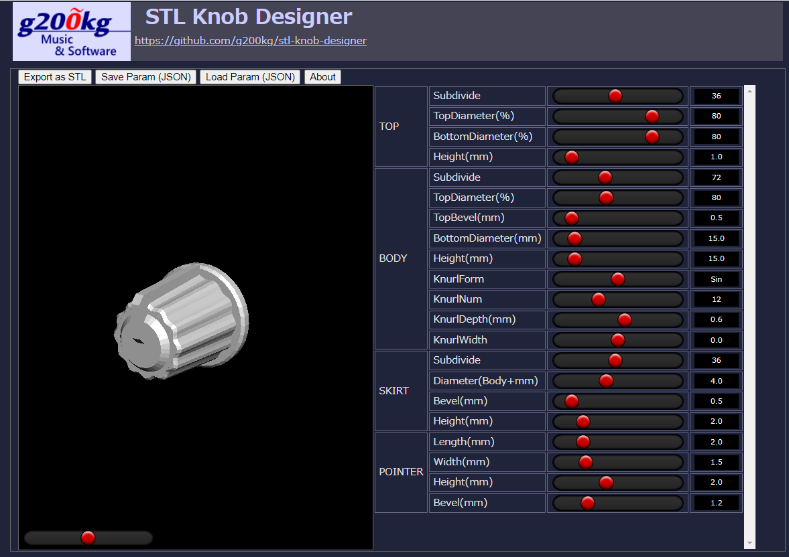
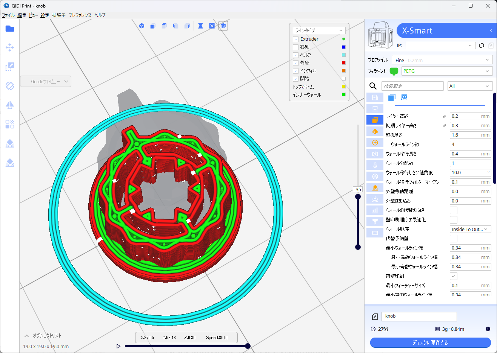
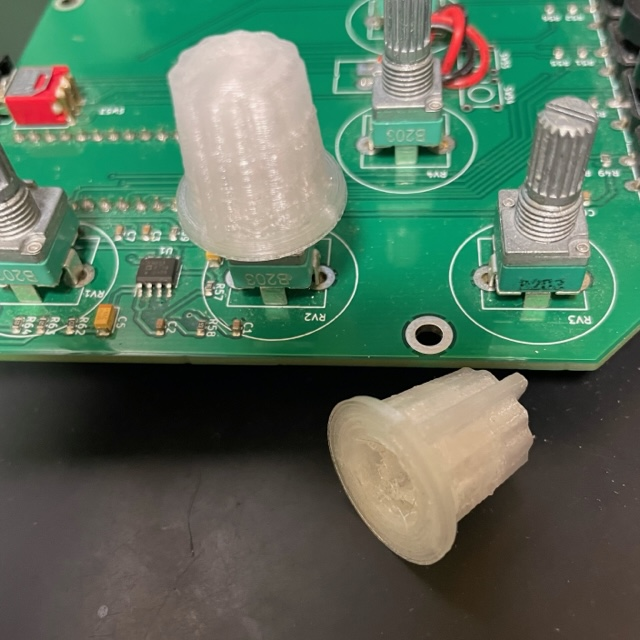

# stl-knob-designer

### Knob Designer for 3D printers

This is a program that generates STL files of potentiometer-knobs for 3D printers. The potentiometer should be a 6mm diameter 15mm long, knurled shaft .

If your printer can output '3DBenchy' model fine without supports, you don't need to add supports.

This program assuming use with an FDM machine, and a slightly elastic filament such as PETG rather than PLA. Also, depending on the printer model, settings and filament type, it may be necessary to fine-tune the fit with the shaft.

The fitting to the shaft can be fine-tuned with [SHAFT]-[FineAdject].

The color setting is not reflected in the STL file, you can pause at a specific layer in the slicer and manually swap filaments.

----

これは 3D プリンタで造形可能なツマミの STL ファイルを生成するプログラムです。6mm 径の 15mm 長、ローレット軸のシャフトを持つポテンショメータ用のツマミのデータを生成します。  

FDM 機での使用を想定しており、フィラメントは PLA よりも PETG 等の多少の弾力性のある材料を推奨します。

サポート無しで '3DBenchy' くらいがちゃんと造形できているのであれば、サポートの追加は必要ありません。
またプリンタの機種やフィラメントの種類によってプリンタの印刷設定等で、軸との篏合を微調整する必要があるかもしれません。

シャフトとの篏合の硬さは [SHAFT]-[FineAdjust] で微調整できます。

色の設定は STL ファイルには反映されませんが、スライサーで TOP 部が始まるレイヤーを確認して、そこでプリンターを一時停止して、フィラメントを手動で入れ替えるなどの手段を取る事ができます。

# Live Demo Page
***[https://g200kg.github.io/stl-knob-designer/](https://g200kg.github.io/stl-knob-designer/)***

----

